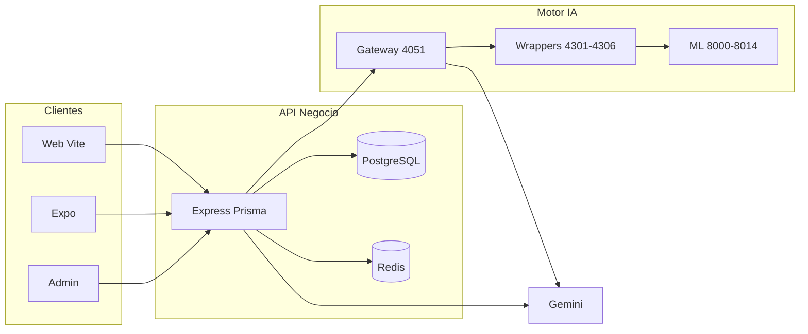

# 13 — Flujos de extremo a extremo

**Última actualización:** 2026-05-21

---

## 1. Análisis de personalidad (usuario autenticado)

```
[Web/Móvil]
  Usuario en /app → crea UserProfile → sube fotos
       ↓
[API negocio :5001/80]
  POST /api/v1/user-profiles/:id/analysis/photos
  POST /api/validate-images (opcional, fase validación)
       ↓
[API Gateway :4051]
  POST /api/v1/analyze-consolidated (multipart)
       ↓
[Paralelo]
  4301 frontal | 4302 perfil | 4304 palmas | 4305 ojos
       ↓ (proxy)
  ML 8000-8012, 8008, 8003-8005, 8009, 8010, 8014
       ↓
[Gateway CPU]
  Tags → filtros → diagnósticos
       ↓
[4306 temperamentos]
  POST /api/v1/calculate-temperament
       ↓
[Gateway]
  scorePersonalityTraits + generatePersonalityNarrative (Gemini)
       ↓
[API negocio]
  Persiste Analysis (JSON character, temperament, narrative, strategies…)
       ↓
[Web/Móvil]
  Visualización resultados + encuesta opcional
```

**Socket.IO:** eventos de progreso durante análisis (mismo host API).

---

## 2. Validación de imágenes (pre-análisis)

```
[Cliente]
  POST /api/validate-images o /validate-images-detailed
       ↓
[API negocio → Gateway]
  POST /api/v1/validate-images
       ↓
[ML]
  Validación frontal 8002 + perfil 8005 (y rotación si configurado)
       ↓
[Cliente]
  Feedback UX: rotar, reencuadrar, rechazar foto
```

---

## 3. Análisis gratuito

```
[Web /free-analysis]
  Fingerprint dispositivo + datos mínimos
       ↓
[API negocio — público]
  POST /api/v1/free-analysis/check-eligibility
  POST /api/v1/free-analysis/create
       ↓
[Gateway] (subset de pipeline)
       ↓
[FreeAnalysis] registro en DB (límites anti-abuso)
```

Doc propuestas: `ANTI_ABUSO_FREE_TRIAL_FREE_ANALYSIS_PROPUESTAS.md`.

---

## 4. Compatibilidad entre perfiles

```
[Web /compatibility]
  Selección 2 perfiles con Analysis
       ↓
[API negocio]
  POST /api/v1/user-profiles/compatibility
       ↓
[compatibilityNarrative.service]
  Cálculo score + Gemini (reglas compatibility-rules/)
       ↓
[CompatibilityAnalysis] persistido
       ↓
[Opcional] GET compatibility-pdf
```

---

## 5. Soporte con IA

```
[Web/Móvil/Admin]
  POST /api/v1/support/chat
       ↓
[support.controller + geminiWithFunctions]
  Function calling: créditos, planes, escalamiento humano
       ↓
[Socket.IO] ticket:*, mensajes tiempo real
       ↓
[Admin] responde o desactiva IA por ticket
```

Detalle: [18-customer-support-ia.md](./18-customer-support-ia.md).

---

## 6. Pago y suscripción

```
[Web]
  Stripe Elements → POST /api/v1/stripe/*
       ↓
[Stripe] → Webhook /api/v1/stripe (raw)
       ↓
[API negocio]
  Actualiza Subscription, Credits, PlanUsage
```

---

## 7. TTS (narración audio)

```
[Web AudioReader]
  POST /api/v1/tts/stream
       ↓
[API negocio proxy]
  POST {TTS_SERVER_URL}/tts/stream
       ↓
[TEXT-TO-VOICE :5032]
  Microsoft Edge TTS → audio/mpeg stream
```

---

## 8. Reportes masivos (operaciones)

```
[Operador]
  python unified_analyzer.py --frontal … --profile …
       ↓
[Host 13.58.240.149:800x] directo (sin gateway)
       ↓
[JSON + PDF] en unified_analysis_results/
```

No persiste en DB producto.

---

## Diagrama simplificado (ecosistema)



---

## Referencias

- Gateway: [04-api-gateway-overview.md](./04-api-gateway-overview.md)
- Frontend UX: [02-frontend-ux-menus.md](./02-frontend-ux-menus.md)
- `API-GATAWAY/docs/15-end-to-end-data-flows.md`
- `SOUL-GATE-FRONTEND-WEB/docs/flujo-analisis-sistema.md`
